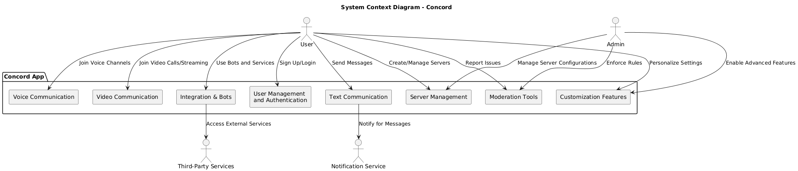
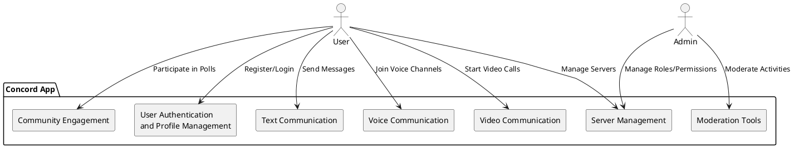
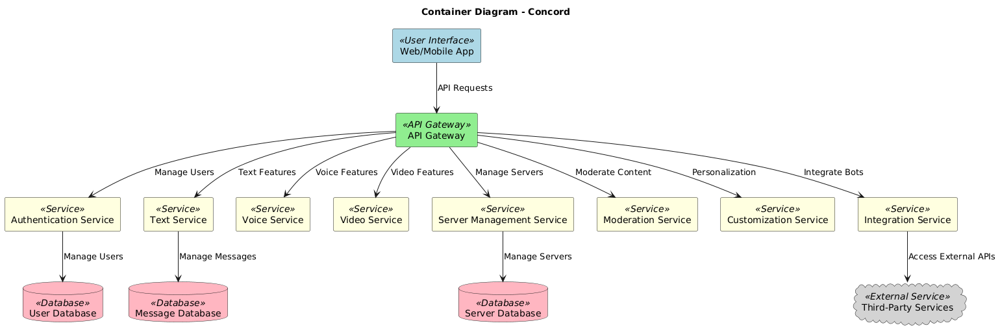
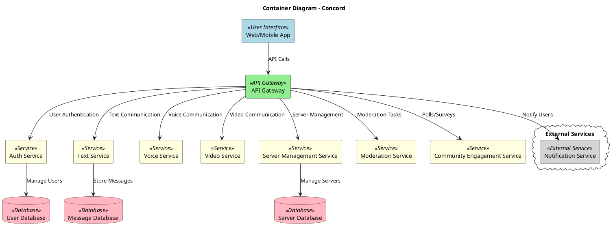
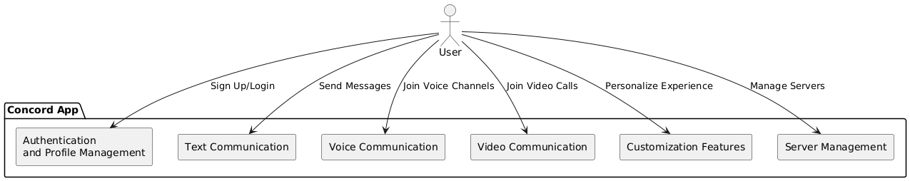
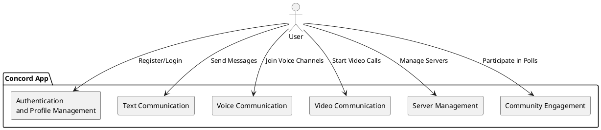
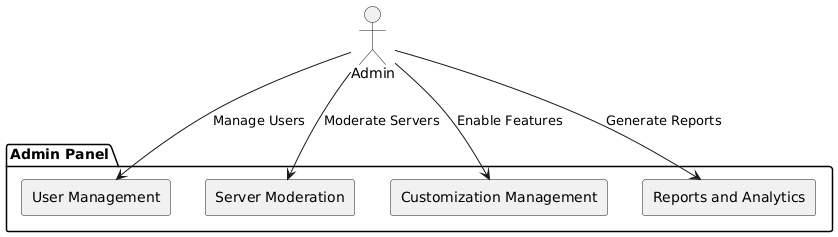
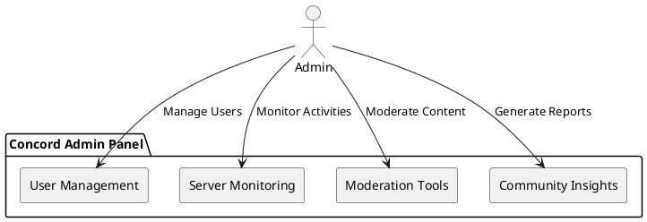
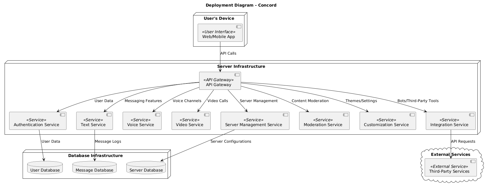
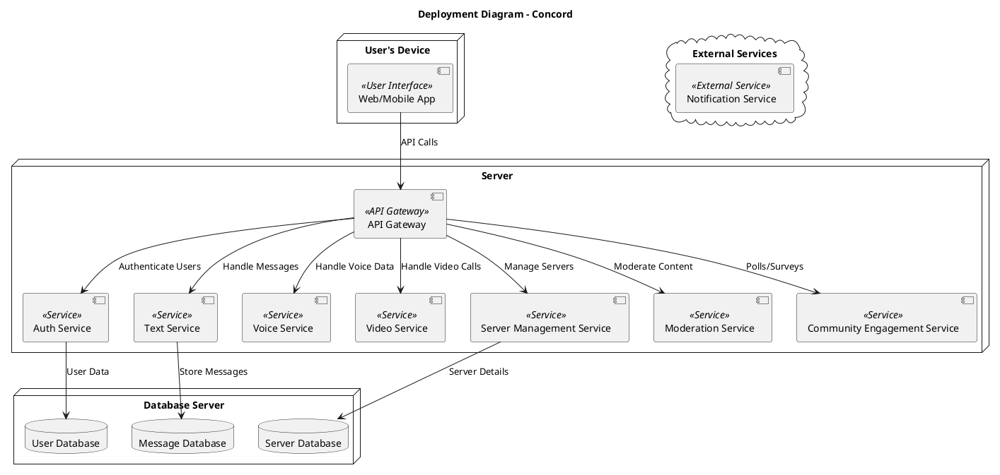

# Architecture.md

## 1. System Context Diagram

## 2. Container Diagram

## 3. Component Diagram

### 3.1 Component Diagram for Users

### 3.2 Component Diagram for Admins

## 4. Deployment Diagram

