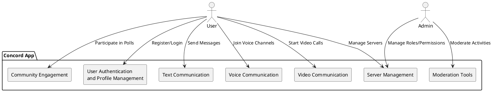

# Architecture.md

## 1. System Context Diagram

```plantuml
@startuml
actor "User" as User
actor "Admin" as Admin

package "Concord App" {
    rectangle "User Authentication \nand Profile Management" as AuthSystem
    rectangle "Text Communication" as TextComm
    rectangle "Voice Communication" as VoiceComm
    rectangle "Video Communication" as VideoComm
    rectangle "Server Management" as ServerMgmt
    rectangle "Moderation Tools" as ModerationTools
    rectangle "Community Engagement" as CommunityEngagement
}

User --> AuthSystem : Register/Login
User --> TextComm : Send Messages
User --> VoiceComm : Join Voice Channels
User --> VideoComm : Start Video Calls
User --> ServerMgmt : Manage Servers
User --> CommunityEngagement : Participate in Polls

Admin --> ServerMgmt : Manage Roles/Permissions
Admin --> ModerationTools : Moderate Activities
@enduml

```
