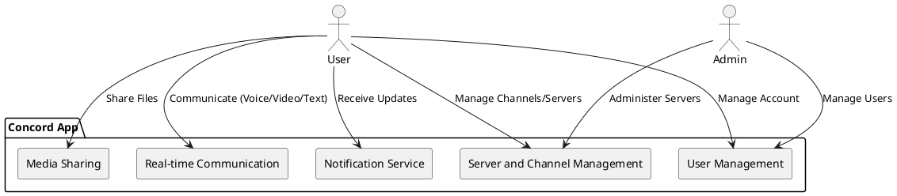
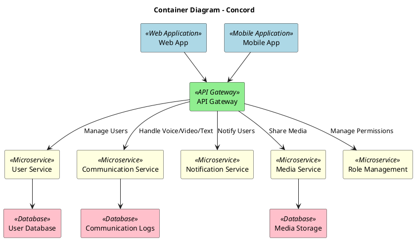

# **Software Design Description (SDD)**

## 1. **Introduction**

### 1.1 **Purpose**
The purpose of this Software Design Description (SDD) is to provide a detailed design for the Concord system. This document outlines the architecture, components, interfaces, and their interactions to ensure that the implementation meets the system's functional and non-functional requirements.

### 1.2 **Scope**
Concord is a real-time communication platform inspired by Discord. It enables users to communicate through voice, video, and text in real-time, offering features like user and role management, channel creation, and notifications. The system focuses on scalability, modularity, and reliability to facilitate seamless communication and collaboration.

---

## 2. **System Overview**

The Concord system allows users to:
- Communicate via voice, video, and text.
- Create and manage servers and channels.
- Assign roles with flexible permissions.
- Share media and files securely.
- Use real-time notifications for activity updates.

Admin users can:
- Manage users and servers.
- Oversee roles and permissions.
- Monitor activity logs and resolve issues.

---

## 3. **System Architecture**

### 3.1 **System Context Diagram**

---

### 3.2 **Container Diagram**

---

## 4. **Module Design**

### 4.1 **Frontend (Web/Mobile Applications)**
The frontend provides an intuitive and responsive interface for users to interact with the platform.

#### Key Components:
- **Home Screen**: Server and channel list, recent activity.
- **Chat Interface**: Real-time messaging with media sharing.
- **Voice/Video UI**: Intuitive controls for voice and video calls.
- **Role Management**: Admin interface for roles and permissions.
- **Profile Settings**: Manage user accounts and preferences.

### 4.2 **Backend System**
- **User Service**: Handles authentication, profile management, and role-based access control.
- **Communication Service**: Provides real-time communication using WebRTC and WebSockets.
- **Notification Service**: Manages user notifications for events and updates.
- **Media Service**: Supports secure media storage and sharing.
- **Role Management**: Administers roles and permissions across channels and servers.

---

## 5. **Database Design**

The Concord system uses a combination of relational and NoSQL databases to manage structured data and unstructured media.

#### Key Entities:
- **Users**: Stores user profiles and authentication details.
- **Servers**: Tracks server configurations and associated channels.
- **Roles**: Manages roles and permissions.
- **Messages**: Logs text, voice, and video communication.
- **Media**: Stores shared files and media securely.

---

## 6. **API Design**

Key API Endpoints:
- **POST /users/register**: Register a new user.
- **POST /users/login**: User login.
- **GET /servers/list**: List available servers.
- **POST /channels/message**: Send a message.
- **GET /notifications**: Fetch notifications.

---

## 7. **Non-Functional Requirements**

## 7.1 Performance: 
- Support for 10,000+ concurrent users.

### 7.2 Scalability:
- Dynamic scaling using cloud infrastructure.

### 7.3 Reliability:
- 99.9% uptime with failover mechanisms.

### 7.4 Security:
- Encrypted communication and secure data storage.

---

## 8. **Conclusion**
This design ensures that Concord is modular, scalable, and robust, enabling seamless communication for users across platforms. It incorporates modern technologies and best practices to meet both functional and non-functional requirements.

---
